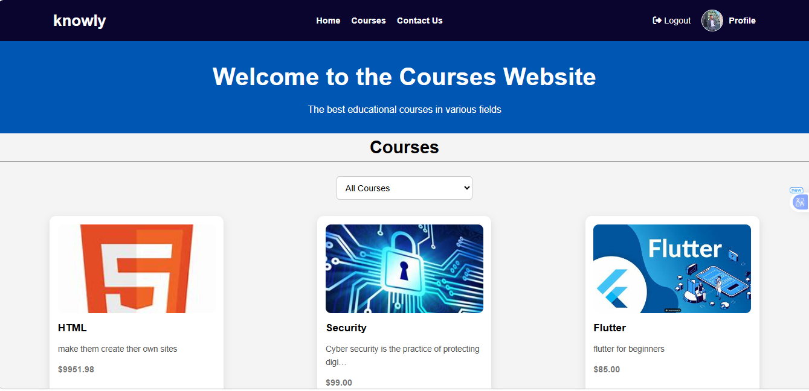
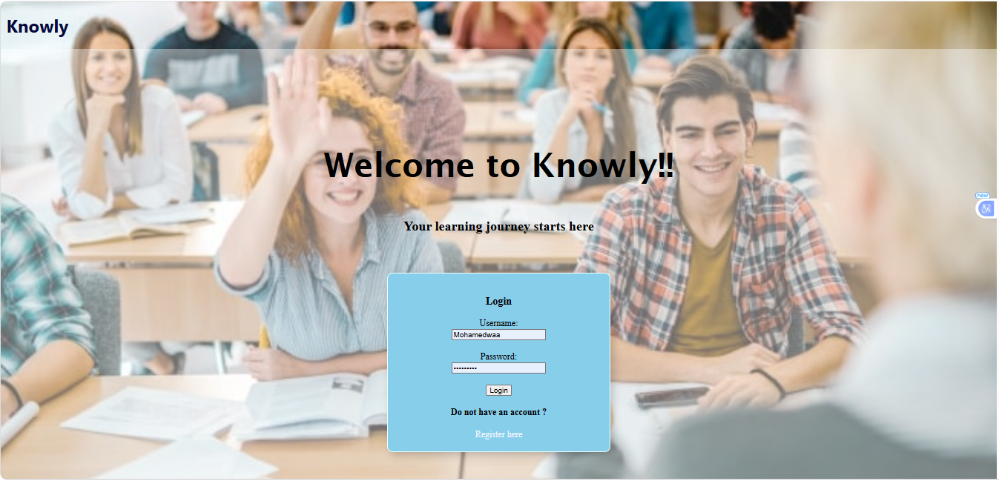
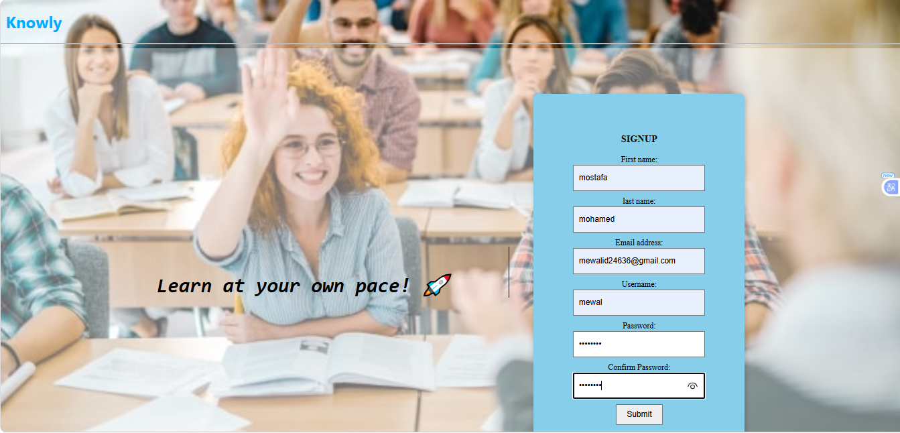
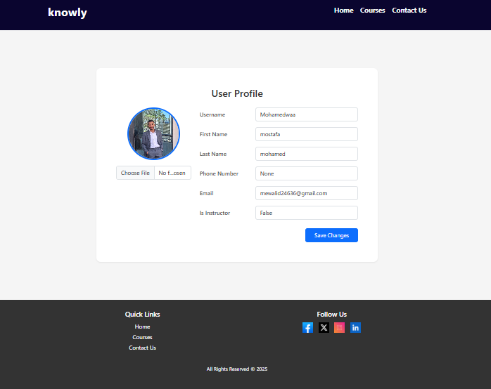
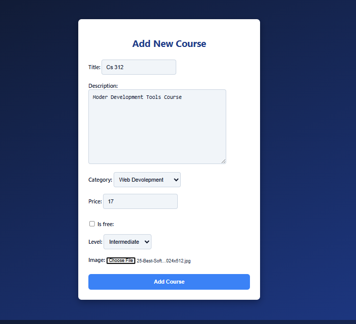
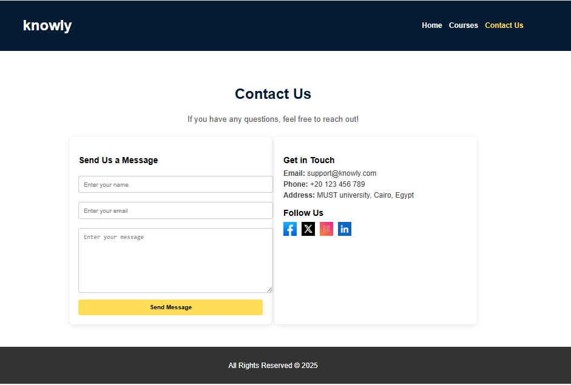
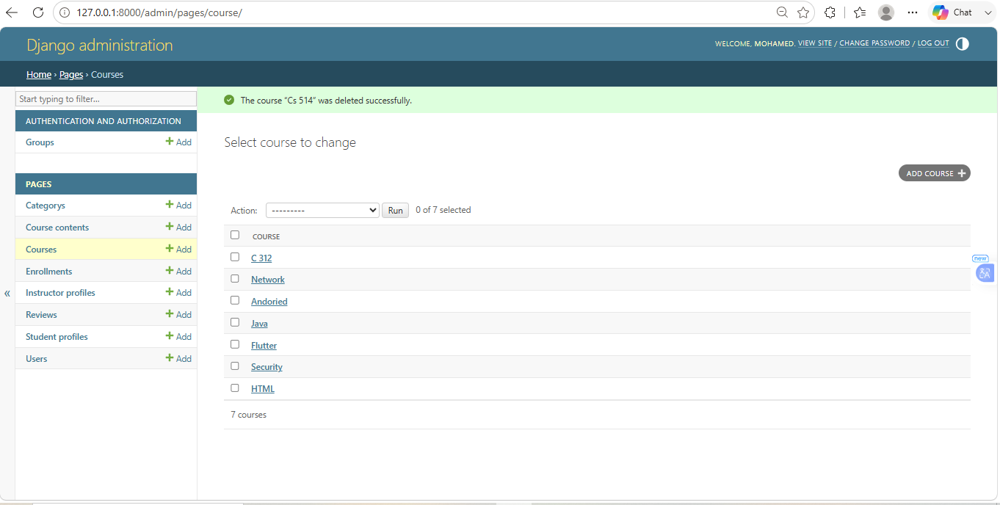

# Knowly

An E-Learning platform built using Django that allows instructors to publish courses and students to browse and access educational content in an organized way.

## My Role

**Backend Developer**

My responsibility was developing the backend side of the application using Django and integrating the frontend pages with the system.

## Features

* Courses Page
* Category Filtering
* Course Details
* Authentication & User Management
* User Profiles
* Contact & Support

## Technologies Used

* Python
* Django
* HTML
* CSS
* Bootstrap
* SQLite

## Screenshots

### Home Page


### Login Page


### Register Page


### Profile Page


### Add Course Form


### Contact Us Page


### Django Admin Panel


## Challenges & Lessons Learned

### 1. Designing Comes Before Building

I started the project without an ERD, database schema, or a clear development plan.

I was creating tables and relationships as I went, which led to inconsistent database design and bad integration between different system parts.

### 2. The Cost of Writing Spaghetti Code

Following an unstructured design approach led to:

* Code duplication problems as the project grew.
* Increased effort and time needed to make small changes, modify code, fix bugs, or add new features.
* Sometimes, a small change required modifying almost the entire codebase.

## Key Takeaway

Building software starts with designing the system, not writing code.

## Installation

```bash
git clone <repository-url>
cd Knowly
pip install -r requirements.txt
python manage.py migrate
python manage.py runserver
```

## Status

Archived — kept as a learning project and portfolio milestone.
